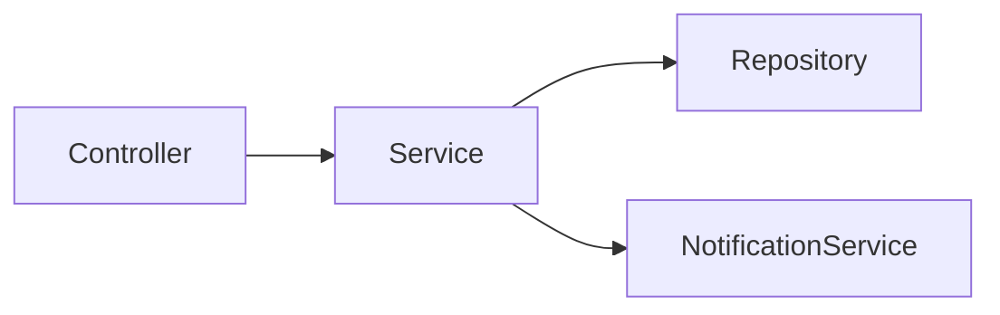
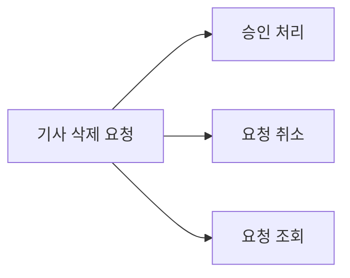
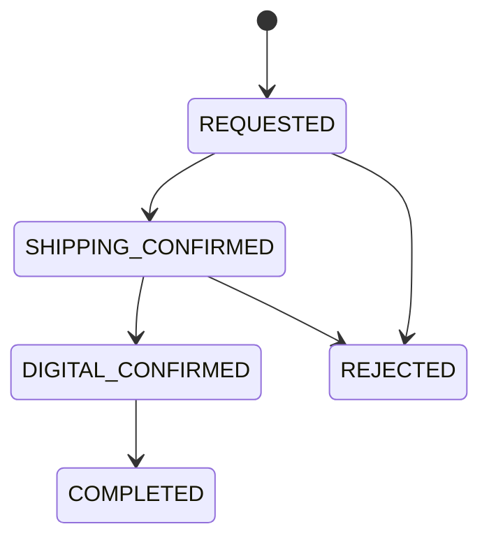

# deliverable-write - 참고 자료

`SKILL.md`의 규칙에 대한 이유, 예시, 상세 기준을 담는다. SKILL.md와 함께 읽는다.

---

## 목적 (왜 이 순서인가)

`deliverable-sync`가 이미 존재하는 현행 문서를 코드 변경에 맞춰 갱신하는 스킬이라면, 이 스킬은 아직 없는 현행 문서를 코드에서 만들어내는 스킬이다.

최종 산출물의 가장 중요한 목적은 코드 설명이 아니다.
문서를 처음 보는 사람이 코드까지 열지 않고도 짧은 시간 안에 다음을 이해할 수 있어야 한다.

1. 이 기능은 어떤 상황에서 시작되는가
2. 실제로 어떤 순서로 처리되는가
3. 처리 중 어떤 조건을 검사하는가
4. 누가 어떤 단계에 관여하는가
5. 상태가 어떻게 변하는가
6. 최종적으로 무엇이 저장되고 누구에게 알림이 가는가
7. 예외적으로 막히는 경우는 무엇인가

코드 클래스와 메서드는 이러한 동작의 근거를 확인하기 위한 정보로 사용한다.
즉 문서의 중심은 다음 순서를 따른다.

```text
실제 동작
-> 업무 흐름
-> 상태 변화
-> 주요 규칙
-> 코드 근거
```

---

## 작성 원칙 (상세)

1. 컨트롤러에서 시작해 안쪽으로 읽는다.
   * 엔드포인트 목록으로 외부에서 실행 가능한 액션을 먼저 찾는다.
   * 이후 해당 액션이 실제로 어떤 흐름으로 실행되는지 Service, Entity, Repository 등을 따라간다.
2. 코드에서 확인되는 사실만 기록한다.
3. 의도와 동작을 구분한다.
   * 코드로 확인되는 것은 동작으로 기록한다.
   * 왜 그렇게 만들었는지는 커밋, ADR, 이력 문서 등 근거가 있는 경우만 기록한다.
   * 확인할 수 없으면 추측하지 않는다.
4. 설명보다 시각화를 우선한다.
5. 가장 중요한 내용을 가장 먼저 배치한다. 코드 경로나 클래스 설명보다 실제 실행 흐름이 먼저 나온다.
6. 한 문서에는 하나의 업무 흐름만 담는다.

---

## 문서 표현 규칙 - 이모지 사용 금지

산출물 전체에서 이모지를 사용하지 않는다.
제목, 경고, 상태, 주석, 표, 예시를 포함하여 이모지를 넣지 않는다.
"완료", "주의", "중요", "체크" 등에 이모지를 붙인 모든 형태를 쓰지 않는다.

강조가 필요하면 Markdown 구조를 사용한다.

```markdown
> [!IMPORTANT]
> 반드시 출고부서 확인 이후에만 디지털 확인이 가능하다.
```

또는:

```markdown
**중요 규칙**
출고부서 확인이 완료되지 않으면 디지털 확인을 할 수 없다.
```

---

## 1. 실행 흐름

문서에서 가장 중요한 절이다.
코드 클래스 관계를 그리지 않는다.
사용자 또는 시스템의 행동이 시작된 이후 비즈니스 처리가 어떤 순서로 진행되는지를 표현한다.

좋은 예:


좋지 않은 예:



후자는 코드 호출 관계일 뿐 업무 동작을 설명하지 않는다.
코드 호출 구조가 반드시 필요한 경우 실행 흐름과 분리하여 후반부에 보조 자료로 둔다.

### 실행 흐름 작성 기준

다음 항목을 가능한 한 흐름 안에 포함한다.

* 누가 시작하는가
* 최초 입력은 무엇인가
* 주요 검증
* 상태 변경
* 다음 처리 주체
* 승인/거절 등의 분기
* 완료 조건
* 주요 부수 효과 (이력, 알림, 외부 이벤트)

단순 내부 구현은 넣지 않는다. 다음은 기본적으로 제외한다.

```text
DTO 변환
Mapper 호출
Repository save 메서드 호출
Optional 처리
Builder 호출
Entity getter
```

비즈니스 흐름을 이해하는 데 필요한 경우만 표현한다.

### 실행 흐름이 여러 개인 경우

한 도메인 안에 주요 흐름이 여러 개라면 먼저 최상위 흐름을 하나 보여준다.



그 다음 복잡한 흐름만 별도로 상세화한다.

```markdown
### 승인 흐름
```


모든 API별로 Mermaid를 하나씩 만들지 않는다.

---

## 2. 한눈에 보기

실행 흐름 다음에는 업무를 압축해서 보여준다. 긴 설명 대신 표를 기본으로 한다.

| 구분 | 내용 |
|---|---|
| 목적 | 기사 삭제 요청부터 최종 승인까지 처리 |
| 시작 | 기자가 삭제 요청 |
| 주요 참여자 | 기자, 출고부서, 디지털부서, 국장 |
| 주요 흐름 | 요청 -> 출고 확인 -> 디지털 확인 -> 최종 승인 |
| 반려 가능 단계 | 출고 확인, 디지털 확인 |
| 완료 조건 | 필요한 승인 단계가 모두 완료됨 |
| 완료 결과 | 처리 상태 변경, 이력 기록, 관련 사용자 알림 |

이 절은 세부 구현을 설명하지 않는다.
문서를 처음 본 사람이 실행 흐름과 이 표만 읽어도 기능을 다른 사람에게 대략 설명할 수 있어야 한다.

---

## 3. 상태 모델

상태가 존재하면 상태 모델을 시각적으로 보여준다.
먼저 상태 전이를 보여주고 그다음 상태 의미를 표로 정리한다.



| 상태 | 의미 |
|---|---|
| `REQUESTED` | 삭제 요청이 생성된 상태 |
| `SHIPPING_CONFIRMED` | 출고부서 확인 완료 |
| `DIGITAL_CONFIRMED` | 디지털부서 확인 완료 |
| `COMPLETED` | 모든 필수 처리 완료 |
| `REJECTED` | 처리 과정에서 반려 |

상태 이름은 실제 코드 값을 사용한다.
코드상 단일 status 값이 없고 여러 Boolean/날짜 컬럼 조합으로 상태가 결정된다면 존재하지 않는 상태 enum을 만들어내지 않는다. 대신 실제 조건을 표시한다.

| 출고 확인 | 디지털 확인 | 국장 승인 | 문서상 의미 |
|:---:|:---:|:---:|---|
| X | X | X | 요청 |
| O | X | X | 출고 확인 완료 |
| O | O | X | 디지털 확인 완료 |
| O | O | O | 최종 완료 |

`문서상 의미`는 설명을 위한 표현이며 실제 코드 상태값이 아님을 명시한다.

---

## 4. 주요 액션

Controller를 기준으로 사용자가 실행할 수 있는 핵심 행동을 정리한다.
API 명세서처럼 모든 endpoint 정보를 나열하지 않는다. 업무 흐름에 영향을 주는 액션을 중심으로 작성한다.

| 액션 | 실행 주체 | 실행 조건 | 주요 결과 |
|---|---|---|---|
| 삭제 요청 | 기자 | 삭제 요청 가능한 기사 | 요청 생성 |
| 출고 확인 | 출고부서 | 요청 상태 | 다음 승인 단계 진행 |
| 디지털 확인 | 디지털부서 | 출고 확인 완료 | 디지털 확인 처리 |
| 최종 승인 | 국장 | 선행 확인 완료 | 처리 완료 |
| 요청 취소 | 요청자 | 취소 가능한 상태 | 요청 취소 |

필요하면 API를 함께 기록한다.

| 액션 | API | 실행 주체 | 결과 |
|---|---|---|---|
| 디지털 확인 | `PUT /{id}/digital-confirm` | 디지털부서 | 확인 상태 변경 |

---

## 코드와 업무 문서의 관계

문서는 업무 흐름이 중심이지만, 모든 규칙은 코드 근거를 가져야 한다.
따라서 문서를 작성할 때 내부적으로는 다음 방향으로 조사한다.

```text
Controller           -> 어떤 액션이 존재하는지 확인
Service / Facade     -> 실제 업무 처리 순서와 가드 확인
Entity / Enum        -> 상태와 불변식 확인
History / Notification / Event -> 부수 효과 확인
Repository           -> 조회 조건 확인
Test / Git           -> 누락 규칙과 변경 배경 확인
```

하지만 최종 문서에는 위 순서를 그대로 노출하지 않는다. 최종 문서는 다음 방향으로 보여준다.

```text
실행 흐름 -> 한눈에 보기 -> 상태 -> 사용자가 수행하는 액션 -> 세부 규칙 -> 근거가 되는 코드 정보
```

---

## 코드 읽는 순서 (상세)

### 1. 범위 확정

읽기 전에 대상 범위를 정한다. 예: `src/main/java/<base>/app/articleDeletionRequest`

먼저 파일 목록만 확인한다(`ls -R <대상 패키지>`). 아직 전체 내용을 읽지 않는다.
파일 목록을 보고 하나의 업무 흐름인지 여러 업무 흐름인지 판단한다.

문서 하나로 작성:

* 서비스 1~2개
* 같은 주요 Entity를 사용
* 같은 상태 모델을 공유
* 처음부터 끝까지 하나의 업무 흐름으로 설명 가능

문서 분리 검토:

* 서로 다른 상태 모델
* 서로 직접 관련 없는 업무 목적
* 독립적으로 시작하고 종료되는 흐름
* 하나의 흐름도로 자연스럽게 표현하기 어려움

처음에는 하나로 조사해도 된다. 실제 코드를 읽고 독립적인 흐름이 확인되면 분리한다.

### 2. Controller

가장 먼저 읽는다.

확인: endpoint, HTTP method, 권한 annotation, 호출하는 Service/Facade, 비즈니스 분기에 영향을 주는 입력값

이 단계에서 먼저 액션 목록을 만든다.

```text
삭제 요청
삭제 요청 취소
출고 확인
디지털 확인
최종 승인
상세 조회
목록 조회
```

아직 상세 내용을 채우지 않는다. 이 액션 목록이 이후 코드 탐색의 기준이다.

### 3. Service / Facade

Controller에서 찾은 public action별로 따라간다.

확인: 선행 조건, 거부 조건, 예외 메시지, 상태 변경, 저장/삭제, 다른 업무 객체 변경, History 호출, Notification 호출, Event 발행, 다음 처리 단계

private 메서드는 해당 public 액션에서 호출되는 것만 따라간다. 사용되지 않는 코드는 현행 문서에 포함하지 않는다.
500줄 이상의 Service라면 먼저 public 메서드 목록을 확인하고 필요한 메서드만 읽는다.

### 4. Entity / Enum

확인: 실제 상태 필드, DB column, 상태값, 상태 변경 메서드, 생성 시 불변식, 상태 변경 시 불변식

상태가 명시적인 enum이 아니라 컬럼 조합이라면 그 사실을 그대로 문서화한다.

### 5. 이력 / 알림 / 이벤트

확인: 어떤 액션에서 발생하는가, `actType`, 기록하는 이전/이후 값, 알림 타입, 수신 대상, 행위자 제외 여부, 중복 제거, 수신 설정 조건, 이벤트가 후속 동작을 발생시키는지

비즈니스 실행 흐름에 중요한 이벤트라면 첫 번째 `실행 흐름`에도 포함한다.

### 6. Repository

모든 Repository를 읽지 않는다. 조회 동작 또는 비즈니스 조건에 영향을 주는 커스텀 쿼리가 있을 때만 확인한다.

확인: 검색 조건, 정렬, 삭제 여부, 상태 필터, 사용자/조직 범위, 존재 여부 판단 조건

### 7. 테스트

테스트 클래스 이름과 `@DisplayName`을 먼저 확인한다. 본문을 처음부터 모두 읽지 않는다.
목적은 코드 탐색에서 놓친 비즈니스 규칙이 있는지 확인하는 것이다.
테스트 이름에서 새로운 규칙이 발견되면 관련 코드까지 다시 확인한다.
테스트에만 있고 실제 코드에서 확인되지 않는 동작은 확정된 현행 규칙으로 기록하지 않는다.

### 8. Git 이력

마지막으로 확인한다. `git log --oneline -20 -- <패키지>`

목적: 최근 상태 모델 변경, 가드 변경, 업무 순서 변경, 기존 vs 현재 작성 필요 여부, 코드만으로 알기 어려운 변경 이유

커밋 메시지만으로 업무 규칙을 확정하지 않는다. 현재 코드와 함께 확인한다.

---

## 5. 액션 상세 작성

각 액션은 동일한 구조를 사용한다. 다만 기계적으로 모든 항목을 길게 채우지 않는다.

````markdown
### 디지털부서 확인

`PUT /{id}/digital-confirm`

**실행 주체**
`ADMIN` 또는 `REQUEST_ARTICLE_DELETION_DIGITAL_APPROVE`

**실행 전 조건**
- 출고부서 확인 완료
- 최종 처리 전 상태

**막히는 경우**

| 조건 | 예외 |
|---|---|
| 출고부서 확인 전 | `"출고부서 확인이 필요합니다."` |
| 이미 완료된 요청 | `"이미 처리된 요청입니다."` |

**처리 흐름**


**상태 변화**
`SHIPPING_CONFIRMED -> DIGITAL_CONFIRMED`

**이력**
`DIGITAL_CONFIRM`

**알림**
최종 승인 담당자에게 알림
````

간단한 액션이라면 별도의 Mermaid를 만들지 않는다. 전체 흐름으로 충분히 설명되는 경우 반복 시각화를 피한다.

### 토글형 액션

`confirm=true|false`처럼 하나의 API가 서로 다른 업무 동작을 수행하면 나누어 작성한다.

```markdown
### 디지털부서 확인

#### 확인 (`confirm=true`)
1. 선행 상태 검증
2. 디지털 확인 처리
3. 이력 기록
4. 다음 담당자 알림

#### 확인 취소 (`confirm=false`)
1. 취소 가능 여부 검증
2. 확인 상태 제거
3. 처리자/처리시각 초기화
4. 취소 이력 기록
```

확인과 취소의 동작이 크게 다르면 흐름을 별도로 시각화한다.

---

## 6. 이력 및 알림

세부 액션에서 설명한 내용을 전체 관점에서 다시 찾기 쉽도록 표로 정리한다.

### 이력

| 발생 시점 | `actType` | 주요 기록값 |
|---|---|---|
| 삭제 요청 | `REQUEST` | 요청 상태 |
| 출고 확인 | `SHIPPING_CONFIRM` | 확인 상태 |
| 디지털 확인 | `DIGITAL_CONFIRM` | 확인 상태 |
| 최종 승인 | `APPROVE` | 완료 상태 |

### 알림

| 발생 시점 | 수신자 | 조건 |
|---|---|---|
| 요청 생성 | 출고 담당자 | 요청자 제외 |
| 출고 확인 | 디지털 담당자 | 중복 제거 |
| 디지털 확인 | 최종 승인 담당자 | 수신 설정 대상 |
| 완료 | 요청자 | 없음 |

---

## 7. 기존 vs 현재

최근 코드 변경으로 중요한 업무 규칙이 달라진 경우에만 작성한다.

| 항목 | 기존 | 현재 |
|---|---|---|
| 디지털 확인 가능 시점 | 별도 제한 없음 | 출고 확인 이후 |
| 완료 조건 | 디지털 확인 | 최종 승인까지 완료 |

왜 변경됐는지는 근거가 있는 경우만 작성한다. 가능한 근거: ADR, 이력 문서, PRD, 커밋 메시지, 테스트 이름. 없으면 변경 이유를 추측하지 않는다.

---

## 8. 알려진 이슈 / TODO

정상 업무 규칙과 분리한다.

```markdown
## 알려진 이슈 / TODO

> [!WARNING]
> `cancel()`의 이력 저장 로직이 현재 주석 처리되어 있어 취소 이력이 저장되지 않는다.

> [!NOTE]
> TODO(sync): 디지털 확인 취소 시 알림을 보내지 않는 동작이 의도된 것인지 확인 필요.
```

다음 내용을 이곳에 둔다.

* 코드와 주석 불일치
* 주석 처리된 중요 로직
* 도달 불가능해 보이는 분기
* 의도를 확인할 수 없는 동작
* 문서 작성 중 발견한 잠재적 문제
* 확신이 부족한 항목

---

## 확신 기준 (상세)

### 확정

다음과 같이 코드에서 직접 확인되는 경우 사실로 기록한다: 조건문, 예외 발생, 권한 annotation, Entity 상태 변경, DB 저장 또는 삭제, 이력 기록, 알림 호출, 이벤트 발행

### 근거와 함께 기록

의도가 커밋 또는 테스트에서 확인되는 경우 근거를 표시한다.

```text
재승인을 방지한다. (커밋 abc1234 기준)
```

### 동작만 기록

무엇을 하는지는 알지만 이유를 모르는 경우 동작만 작성한다.

```text
승인 취소 시 `digitalConfirmedAt`을 null로 변경한다.
```

다음처럼 쓰지 않는다.

```text
다시 승인할 수 있도록 digitalConfirmedAt을 초기화한다.
```

"다시 승인할 수 있도록"이라는 의도가 코드에서 확인되지 않았다면 추측이다.

### 확인 필요

확신이 60% 미만이면:

```markdown
<!-- TODO(sync): 확인 필요 - 디지털 확인 취소 시 알림 미발송 의도 -->
```

그리고 `BOARD.md` 할 일에 올린다.

---

## 산출물 가독성 기준

최종 문서는 다음 테스트를 통과해야 한다.

### 10초 테스트

문서 첫 부분만 봤을 때 다음을 말할 수 있어야 한다: 이 기능이 무엇인지, 누가 시작하는지, 어떤 단계로 진행되는지, 언제 완료되는지

### 30초 테스트

실행 흐름, 한눈에 보기, 상태 모델까지만 읽고 다음을 파악할 수 있어야 한다: 전체 업무 프로세스, 주요 상태, 분기, 주요 참여자, 완료/반려 조건

### 검색 테스트

문서 내 검색 또는 빠른 스크롤로 다음을 쉽게 찾을 수 있어야 한다: 특정 액션, 특정 상태, 특정 예외 메시지, 특정 알림, 특정 권한

---

## 시각화 선택 기준

Mermaid를 무조건 많이 만들지 않는다. 시각화는 이해 시간을 줄일 때만 사용한다.

| 상황 | 표현 |
|---|---|
| 시작부터 종료까지 순서가 있음 | `flowchart` |
| 승인/거절 등 분기가 있음 | `flowchart` |
| 상태 전이가 있음 | `stateDiagram` |
| Boolean/조건 조합 | 표 |
| 역할별 차이 | 표 |
| 가드 조건 여러 개 | 표 |
| 단순 규칙 | bullet |
| 단순 CRUD | 짧은 설명 |

동일한 내용을 Mermaid와 표와 문장으로 세 번 반복하지 않는다. 각 표현에는 목적이 있어야 한다.

---

## 문서 길이 기준

문서가 길어진다고 정보를 삭제하지는 않는다. 대신 구조를 개선한다.

```text
긴 문단 -> bullet -> 표 -> 흐름도 -> 공통 규칙 분리 -> 독립 업무 흐름이면 문서 분리
```

다음은 피한다.

* 하나의 bullet에 여러 문장
* 표 셀 안의 긴 설명
* 같은 가드를 모든 액션에서 반복
* 코드 한 줄마다 대응되는 한국어 설명
* 모든 클래스와 메서드 나열

---

## 마무리 (메타 형식)

```markdown
> 코드: <실제 읽은 코드 범위>
> 기준 커밋: <HEAD>
> 갱신: <오늘>
```

`INDEX.md`에 등록할 때 실제 읽은 파일 기준으로 경로를 잡고, 키워드는 액션과 상태에서 3~5개 선정한다.

---

## 승격 절차 (상세)

기존에 `*-비즈니스로직-이력.md`, `*-비즈니스로직-정리.md` 같은 문서가 있으면 새로 만들지 않는다. 현행 문서 역할을 하고 있다면 승격한다.

1. `git mv`로 `<로직>-비즈니스로직.md`로 변경
2. 기존 링크 수정
3. 메타 정보 추가
4. 현재 문서 구조에 맞춰 절 재배치
5. 기존 문서 내용을 임의로 재해석하지 않음
6. 마지막 수정 이후 코드 변경 확인
7. 필요하면 `deliverable-sync` 수행
8. `INDEX.md` 등록
9. `BOARD.md` 기록
10. 커밋

승격 시 기존 문서에 실행 흐름이 없다면 현재 코드를 확인하고 가장 앞에 추가한다.

---

## 참고

* `deliverable-structure` 스킬 - 문서 위치와 파일명 규칙
* `deliverable-sync` 스킬 - 신규 문서 탐지와 후속 동기화
* `ddd-spring` 스킬 - Controller, Service, Domain 책임 구분
* `api-design` 스킬 - 액션 엔드포인트 규칙(`POST .../confirm`), 에러 코드 체계. 문서의 "막히는 경우" 표는 ErrorCode와 대응된다
