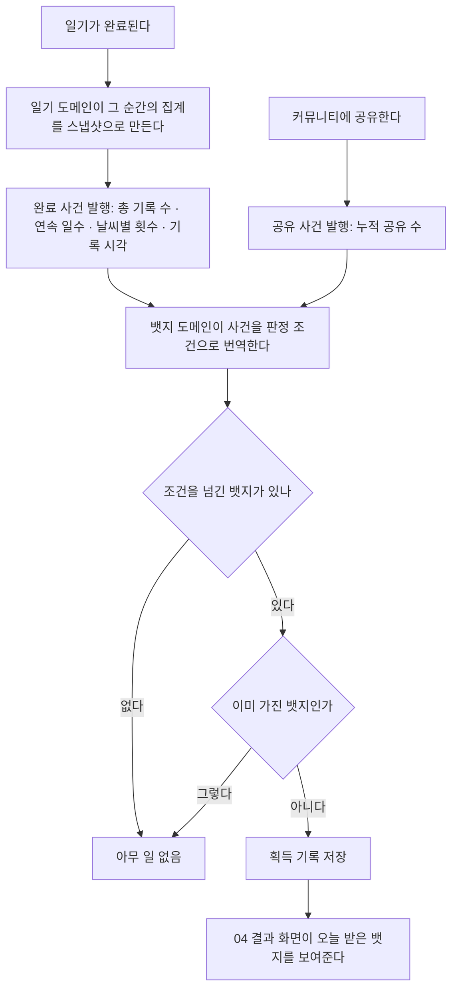
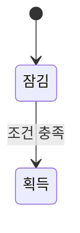

# 뱃지 획득 비즈니스 로직

> 도메인: `com.jellydiary.badge` · 엔티티 `Badge`(`tb_badge`, 정의) / `UserBadge`(`tb_user_badge`, 획득)
> 코드: `api/src/main/java/com/jellydiary/badge/**` · 갱신: 2026-09-22

## 1. 실행 흐름

## 2. 한눈에 보기

| 항목 | 내용 |
|---|---|
| 목적 | 계속 기록할 이유를 만든다 |
| 시작 | 일기가 완료되거나 커뮤니티에 공유할 때. 사용자가 직접 요청하지 않는다 |
| 주요 흐름 | 사건 -> 조건 판정 -> 획득 저장 |
| 완료 조건 | 조건을 만족한 뱃지가 저장된다 |
| 하루 한도 | 없음. 단 같은 뱃지는 평생 한 번 |

## 3. 상태 모델

뱃지는 **미획득 -> 획득** 한 방향뿐이다. 되돌리지 않는다.

## 4. 주요 액션

| 액션 | 실행 주체 | 실행 조건 | 주요 결과 | API |
|---|---|---|---|---|
| 획득 판정 | 서버 | 일기 완료 / 공유 발생 | 새 뱃지 저장 | 없음(이벤트) |
| 컬렉션 조회 | 본인 | - | 정의된 뱃지 전체 + 획득 여부 | `GET /api/v1/badges` |

## 5. 액션 상세

### 5.1 뱃지 12종 (시안 기준)

seed 는 `sql/patch/2026-09-22-badge-마스터-테이블.sql`.

| 코드 | 이름 | 조건 | 지표 / 임계값 | 지금 얻을 수 있나 |
|---|---|---|---|---|
| `FIRST_RECORD` | 첫 기록 | 1일 | `TOTAL_RECORDS / 1` | O |
| `JELLY_7` | 젤리 7 | 7일 연속 | `STREAK_DAYS / 7` | O |
| `JELLY_14` | 젤리 14 | 14일 연속 | `STREAK_DAYS / 14` | O |
| `SUNNY_COLLECTOR` | 맑음 수집가 | 맑음 10회 | `SUNNY_RECORDS / 10` | O |
| `RAINY_DAY` | 비 오는 날 | 비 5회 | `RAIN_RECORDS / 5` | O |
| `RAINBOW_30` | 무지개 30 | 30일 연속 | `STREAK_DAYS / 30` | O |
| `FOUR_SEASONS` | 사계절 | 365일 | `TOTAL_RECORDS / 365` | O |
| `EMOTION_EXPLORER` | 감정 탐험가 | 6종 전부 | `ALL_WEATHERS / 1` | O |
| `DAWN_WRITER` | 새벽 기록 | 04시 기록 | `DAWN_RECORD / 1` | O |
| `SHARE_KING` | 공유왕 | 10회 공유 | `SHARES / 10` | O |
| `FIRST_COMMENT` | 첫 댓글 | 커뮤니티 | `COMMENTS / 1` | **X** - 댓글 기능이 없다 |
| `PREMIUM` | 프리미엄 | 구독 시작 | `PREMIUM / 1` | **X** - 결제가 없다 |

정의는 `tb_badge` 마스터 테이블이다. 시안이 말한 40종을 채울 때마다 배포하지 않으려는 것이다.

**코드와 데이터를 나눈 지점**

| 무엇 | 어디 | 바꾸려면 |
|---|---|---|
| 이름, 조건 문구, 임계값, 정렬 | `tb_badge` | SQL |
| 무엇을 재는가(`BadgeMetric`) | 코드 | 배포 |
| 판정식(`지표 값 >= 임계값`) | 코드(`Badge.isEarnedBy`) | 배포 |

"맑음 20회"는 INSERT 한 줄이다. "댓글을 30일 안에 10개"처럼 **새로운 종류의 지표**가 필요하면
`BadgeMetric`에 값을 더하고 `BadgeCriteria`에 그 값을 채우는 자리를 만들어야 한다.

> [!WARNING]
> `metric`에 코드에 없는 값을 넣으면 그 뱃지는 **조용히 영원히 안 걸린다.** 에러가 나지 않는다.

시안의 "40개" 중 나머지 28개는 아직 정의되지 않았다. 그래서 진행 요약은 `12 / 40`이 아니라
`획득 수 / 지금 정의된 수`를 보여준다.

### 5.2 판정의 입력 (`BadgeCriteria`)

뱃지 도메인은 일기도 커뮤니티도 **모른다.** 사건을 판정 조건으로 번역하는 곳은
`BadgeEarningListener` 한 곳뿐이다.

| 필드 | 어디서 오나 |
|---|---|
| `totalCount`, `streakDays` | 일기 완료 사건의 스냅샷 |
| `sunnyCount`, `rainCount` | 같은 스냅샷의 날씨별 횟수 |
| `allWeathers` | 날씨 6종을 다 모았는지. "6"은 날씨 enum이 알고 여기 오면 참/거짓이다 |
| `dawnRecord` | 기록 시각(Asia/Seoul)이 새벽(04시)인지 |
| `shareCount` | 커뮤니티 공유 사건 |
| `commentCount`, `plus` | 아직 항상 0/false |

### 5.3 중복 지급

같은 뱃지를 두 번 주지 않는 것은 **부분 unique 인덱스**가 보장한다.
일기 완료와 공유가 거의 같은 순간에 일어나 두 판정이 겹쳐도, 한쪽이 제약에 걸리고
그건 "이미 받았다"는 뜻이라 조용히 넘긴다(`badge.already_earned` 로그).

### 5.4 04 화면의 "획득!" 카드

판정은 서버만 한다. 앱은 `GET /api/v1/badges`에서 **`earnedAt`이 오늘인 뱃지**를 골라 보여줄 뿐이다.
클라이언트가 조건을 계산하지 않는다.

## 6. 이력 및 알림

- 획득 시각(`earned_at`)이 곧 이력이다. 별도 이력 테이블 없음
- 알림 없음. 04 화면에서만 알린다(완료 푸시는 미정)
- 로그 이벤트: `badge.earned`, `badge.already_earned`

## 7. 트랜잭션 경계

| 질문 | 이 도메인의 답 |
|---|---|
| 전부 취소되어야 하는 범위 | 뱃지 지급 1건 |
| 부분 성공 허용 | 허용. 3개 중 2개만 들어가도 나머지는 다음 사건에서 다시 판정된다 |
| 같은 뱃지 동시 지급 | unique 제약으로 한쪽만 성공, 나머지는 무시 |
| 재시도 안전성 | 안전하다(멱등). 같은 사건을 두 번 받아도 결과가 같다 |

뱃지 판정은 일기 저장 트랜잭션 **밖**에서 일어난다. 판정이 실패해도 일기는 남는다.

## 8. 알려진 이슈 / TODO

- [ ] 나머지 28개 뱃지 정의 (07 화면 문서 7장). 기존 지표로 되면 SQL, 아니면 `BadgeMetric` 추가
- [ ] 뱃지 마스터를 매 판정마다 읽는다(12행이라 괜찮다). 수십 종이 되면 캐시와 무효화 규칙이 필요하다
- [ ] 관리 화면 없음. seed 수정은 사람이 SQL로 한다
- [ ] "다음 뱃지" 추천 로직 - 현재 진행 요약에 개수만 보여준다
- [ ] 소급 획득: 조건을 이미 넘긴 기존 사용자는 **다음 기록 때** 받는다. 일괄 소급 배치가 없다
- [ ] `FIRST_COMMENT`·`PREMIUM`은 댓글·결제가 붙기 전까지 영원히 잠김
- [ ] 뱃지 상세/공유 화면 유무 미정

## 변경 이력

| 날짜 | 내용 |
|---|---|
| 2026-09-22 | 최초 작성 (07 구현) |
| 2026-09-22 | 정의를 코드 enum에서 `tb_badge` 마스터 테이블로 이전 |
