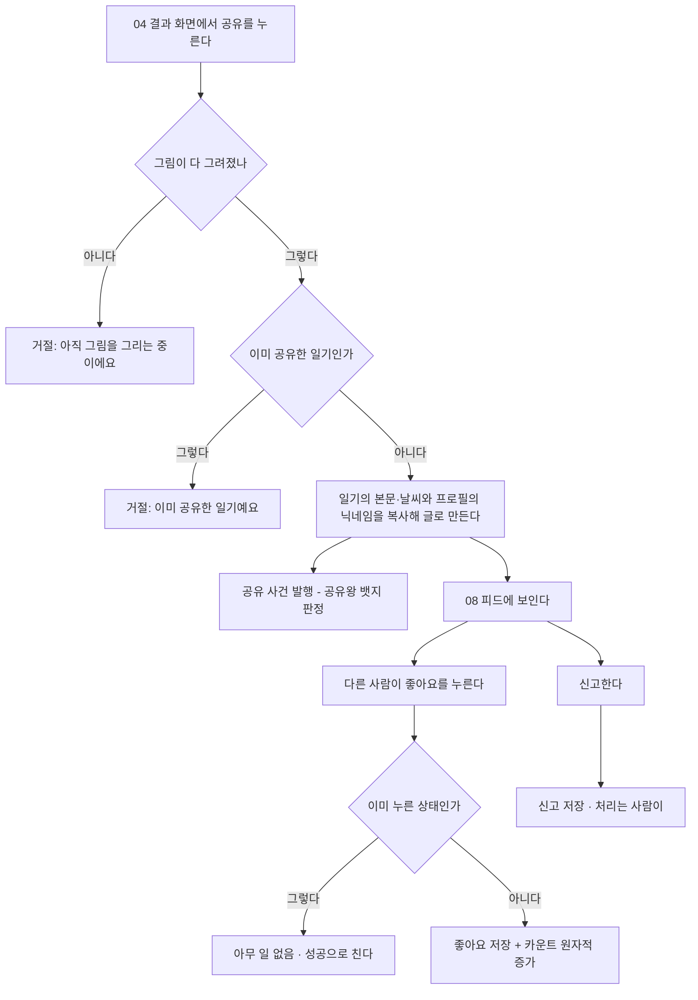
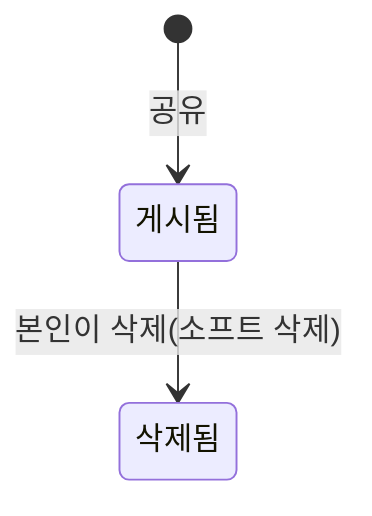

# 커뮤니티 피드 비즈니스 로직

> 도메인: `com.jellydiary.community` · 엔티티 `CommunityPost`/`PostLike`/`PostReport`
> 코드: `api/src/main/java/com/jellydiary/community/**` · 갱신: 2026-09-22

## 1. 실행 흐름

## 2. 한눈에 보기

| 항목 | 내용 |
|---|---|
| 목적 | 다른 사람의 오늘 날씨를 구경하고 반응한다 |
| 시작 | 04에서 "공유", 또는 커뮤니티 탭 열기 |
| 주요 참여자 | 글쓴이, 다른 사용자 |
| 주요 흐름 | 공유 -> 피드 노출 -> 좋아요 / 신고 |
| 완료 조건 | 글이 피드에 보인다 |
| 하루 한도 | 없음. 단 일기 1건당 공유 1회 |

## 3. 상태 모델

신고는 글의 상태를 바꾸지 않는다. 자동 숨김 규칙이 아직 없다.

## 4. 주요 액션

| 액션 | 실행 주체 | 실행 조건 | 주요 결과 | API |
|---|---|---|---|---|
| 공유 | 본인 | 본인 일기, `DONE`, 미공유 | 글 생성 | `POST /api/v1/community/posts` |
| 피드 조회 | 누구나(로그인) | - | 커서 페이지 | `GET /api/v1/community/posts` |
| 좋아요 / 취소 | 누구나 | 글 존재 | 카운트 증감 | `POST`/`DELETE` `.../like` |
| 신고 | 누구나 | 같은 글 최초 1회 | 신고 저장 | `POST .../report` |
| 삭제 | 글쓴이 | 본인 글 | 소프트 삭제 | `DELETE .../{id}` |

## 5. 액션 상세

### 5.1 공유 = 참조가 아니라 복사

08 화면 문서 6장이 남긴 갈림길("복사인가 참조인가")에서 **복사**를 택했다.

- 글은 게시 시점의 본문·날씨·닉네임을 자기 행에 들고 있다
- 원본 일기를 다시 그리거나 지워도 피드는 그대로다
- 대신 원본을 고쳐도 피드에 반영되지 않는다. 고치고 싶으면 지우고 다시 공유한다

본문·날씨·작성자명은 **클라이언트가 보내지 않는다.** 서버가 일기와 프로필에서 읽어 채운다.
클라이언트가 보내면 그 자리가 위변조 지점이 된다.

| 조건 | 응답 | ErrorCode |
|---|---|---|
| 그리는 중이거나 실패한 일기 | 422 | `DIARY_NOT_DONE` |
| 이미 공유함 | 409 | `POST_ALREADY_SHARED` |
| 남의 일기 | 404 | `DIARY_NOT_FOUND` |

### 5.2 정렬과 필터

시안의 필터 줄은 인기·최신·맑음·비가 한 줄에 섞여 있다. **축이 둘이라** 나눠 받는다:
정렬 1개(`sort`) + 날씨 다중(`weather`).

| 정렬 | 커서 키 | 인덱스 |
|---|---|---|
| `RECOMMENDED` | `(추천 점수, id)` | 점수가 사용자마다 달라 인덱스를 못 만든다. `ix_community_post_weather_id_desc` 로 후보만 좁힌다 |
| `LATEST` | `id` | `ix_community_post_id_desc` |
| `POPULAR` | `(like_count, id)` | `ix_community_post_like_count_id_desc` |

### 5.2-1 추천 정렬

점수 = **날씨 일치 2 + 기분 점수 1칸 이내 1 + 최근 3일 1**(0~4). 규칙은 `FeedTaste` 한 곳에 있고,
정렬용 JPQL 표현식과 커서용 자바 계산이 **같은 파일에 나란히** 있다 - 둘이 갈라지면 페이지가 겹치거나 빠진다.

- 기준("내 오늘")은 요청 시작에 한 번 읽어 고정한다. 페이지마다 다시 읽으면 2페이지에서 순서가 바뀐다.
- **콜드 스타트**: 오늘 기록이 없으면 조용히 `LATEST`로 떨어진다. 빈 화면을 만들지 않는다.
- 임베딩을 쓰지 않았다. 유사도 사다리의 1단계다(`feed-ranking` 3장) - 올릴 근거가 측정되면 그때 올린다.

### 5.2-2 다양성 - 상위 10개 중 2개는 다른 날씨

> [!IMPORTANT]
> 유사도만으로 정렬하면 우울한 사용자에게 우울한 글만 보인다. 감정을 다루는 제품에서 이건 사고다.

`FeedDiversity`가 상위 10개에 다른 날씨가 2개 미만이면 그 아래에서 점수가 가장 높은 다른 날씨 글을 끌어올린다.

| 규칙 | 왜 |
|---|---|
| **재배열이지 교체가 아니다** | 페이지의 글 목록이 바뀌면 다음 페이지가 겹치거나 빠진다. 커서는 재배열 **전**의 점수 순서에서 뽑는다 |
| 1등은 밀리지 않는다 | 자리를 내주는 건 상위 구간에서 점수가 가장 낮은 같은 날씨 글 |
| 후보가 페이지에 없으면 그대로 | 다양성 때문에 다음 페이지를 미리 읽지 않는다 |
| 날씨를 직접 고르면 섞지 않는다 | "비만 보여 줘"에 맑음을 끼워 넣는 건 다양성이 아니라 요청 무시다 |

10과 2는 `FeedDiversity.WINDOW`·`MIN_DIFFERENT` 상수다. 표시 규칙이라 설정으로 빼지 않았다 -
운영이 조절할 값이 되면 그때 `app.community.*`로 올린다.

커서는 정렬 이름을 안에 싣는다. 정렬을 바꾸면 이전 커서가 400 `COMMON_INVALID_CURSOR`가 되고,
앱은 처음부터 다시 읽는다. 오프셋 페이징은 쓰지 않는다.

> [!NOTE]
> "인기"는 좋아요 누적순이다. 시간 감쇠가 없어 오래된 글이 계속 위에 남는다.
> 정렬 기준은 08 화면 문서 7장의 미정 항목이다.

### 5.3 좋아요

- **멱등이다.** 이미 누른 상태로 다시 POST해도 204이고 수치는 변하지 않는다
- 중복은 애플리케이션 검사가 아니라 `(post_id, user_id)` unique 인덱스가 막는다. 검사와 저장 사이의 경쟁 상태가 남지 않는다
- 카운트는 읽어서 더하지 않고 `UPDATE ... SET like_count = like_count + 1`로 원자적으로 바꾼다. 감소는 `like_count > 0` 조건을 붙여 음수로 내려가지 않게 한다
- 앱은 낙관적 업데이트를 하고 실패하면 되돌린다

### 5.4 신고

시안에 없지만 UGC를 배포하려면 필수다(`app-store-release`). 사유 5종(`ABUSE`/`SPAM`/`SEXUAL`/`PRIVACY`/`OTHER`)을 받고
같은 사람이 같은 글을 두 번 신고하지 못하게 막는다.

> [!WARNING]
> **처리 도구가 없다.** 신고가 쌓이기만 하고 자동 숨김도 관리 화면도 없다.
> 실제 배포 전에 최소한 "신고 N건이면 자동 숨김"과 차단 기능이 필요하다.

## 6. 이력 및 알림

- 삭제는 소프트 삭제(`deleted_at`). 신고 조사에 원문이 필요하다
- 알림 없음. 좋아요를 받아도 글쓴이에게 알리지 않는다
- 로그 이벤트: `community.post_shared`, `community.post_reported`(WARN)

## 7. 트랜잭션 경계

| 질문 | 이 도메인의 답 |
|---|---|
| 전부 취소되어야 하는 범위 | 글 1건 생성 / 좋아요 1건 / 신고 1건 |
| 부분 성공 허용 | 공유 후 뱃지 판정이 실패해도 글은 남는다 |
| 버튼을 두 번 누르면 | 공유는 409, 좋아요는 멱등하게 무시 |
| 같은 행 동시 변경 | 좋아요 카운트는 원자적 UPDATE라 낙관 락을 타지 않는다 |
| 재시도 안전성 | 좋아요·신고는 안전. 공유는 unique 제약으로 두 번째가 409 |

## 8. 알려진 이슈 / TODO

- [ ] **신고 처리 도구와 차단이 없다.** 배포 전 필수
- [ ] 댓글 기능 없음. `commentCount`는 항상 0이다
- [ ] 게시글 상세 화면 없음. 카드 탭 동작이 없다
- [ ] 익명 여부·닉네임 변경 정책 미정. 현재는 프로필 닉네임이 그대로 노출된다
- [ ] "인기" 정렬에 시간 감쇠 없음
- [ ] 추천 점수 규칙이 SQL과 자바 두 곳에 있다. 통합 테스트로 묶어야 한다(Docker 필요)
- [ ] 비로그인 열람 허용 여부 미정. 지금은 사용자 헤더가 없으면 401

## 변경 이력

| 날짜 | 내용 |
|---|---|
| 2026-09-22 | 최초 작성 (08 구현) |
