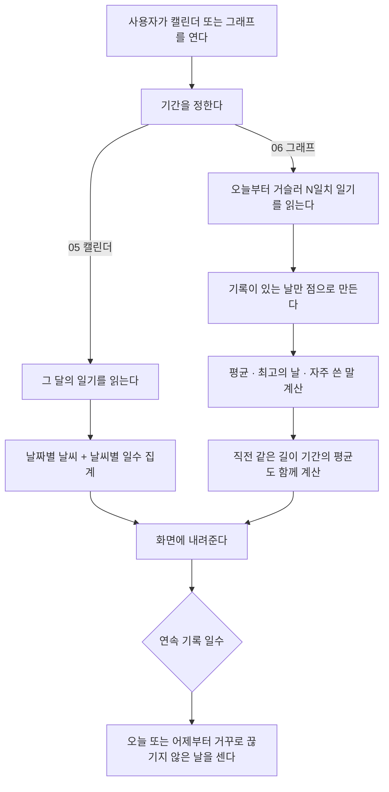

# 감정 집계 비즈니스 로직 (캘린더 · 그래프 · 연속 기록)

> 도메인: `com.jellydiary.diary` · 새 테이블 없음. `tb_diary`를 기간으로 잘라 읽는다
> 코드: `api/src/main/java/com/jellydiary/diary/service/DiaryStatsService.java`, `diary/type/StatsPeriod.java`, `common/util/StreakCalculator.java`, `common/util/WordCounter.java` · 갱신: 2026-09-22

## 1. 실행 흐름

집계는 전부 **서버가 한다.** 앱이 다시 세면 05와 06이 다른 숫자를 보여주게 된다.

## 2. 한눈에 보기

| 항목 | 내용 |
|---|---|
| 목적 | 쌓인 일기를 달력·추이·누적 지표로 보여준다 |
| 시작 | 사용자가 캘린더/그래프 탭을 열거나 홈이 연속 배지를 그린다 |
| 주요 흐름 | 읽기 전용. 아무것도 바꾸지 않는다 |
| 완료 조건 | 없음(조회) |
| 저장소 | 새 테이블 없음. `tb_diary` 만 읽는다 |

## 3. 상태 모델

상태가 없다. 조회 전용 로직이다.

## 4. 주요 액션

| 액션 | 실행 주체 | 실행 조건 | 주요 결과 | API |
|---|---|---|---|---|
| 월 달력 보기 | 본인 | - | 날짜별 날씨 + 월 요약 | `GET /api/v1/diaries/calendar` |
| 추이 보기 | 본인 | - | 점 목록 + 평균·최고의 날·자주 쓴 말 | `GET /api/v1/diaries/stats` |
| 누적 지표 보기 | 본인 | - | 총 기록 수, 연속 일수 | `GET /api/v1/diaries/overview` |

## 5. 액션 상세

### 5.1 연속 기록 일수 (`StreakCalculator`)

**02·06·10이 반드시 같은 값을 보여야 하므로 계산은 이 클래스 한 곳에만 있다.**

| 상황 | 결과 | 왜 |
|---|---|---|
| 오늘 썼고 어제도 썼다 | 오늘 포함해서 센다 | - |
| 오늘은 아직 안 썼고 어제까지 썼다 | **유지된다** | 자정부터 기록 전까지 0일로 보이면 "끊겼다"는 잘못된 신호가 된다 |
| 그제까지만 썼다 | 0 | 어제가 비었으면 끊긴 것이다 |
| 중간에 하루가 빈다 | 그 앞은 세지 않는다 | - |

조회 창은 400일이다(`STREAK_WINDOW_DAYS`). "사계절 365일" 뱃지를 판정할 수 있는 최소치보다 넉넉하게 잡았다.

### 5.2 월 집계 (05)

- 기록이 있는 날만 `days`에 담는다. 빈 칸은 앱이 날짜로 채운다.
- 날씨가 아직 없는 일기(`GENERATING`/`FAILED`)는 집계에서 뺀다.
- 월 요약은 날씨별 일수를 많은 순으로 내려준다. 기록이 0건이면 `recordedDays`가 0이고 앱은 빈 상태 문구를 보여준다.

### 5.3 추이와 지표 (06)

| 항목 | 규칙 |
|---|---|
| 기간 | `WEEK`=7일, `MONTH`=30일, `YEAR`=365일. **오늘을 포함한** N일 |
| 점 | 기록이 있고 점수가 있는 날만. **무기록일은 없다** |
| 평균 | 기록이 있는 날만의 평균, 소수 첫째 자리 반올림. 기록 0건이면 `null` |
| 비교 | 바로 앞의 같은 길이 기간 평균. 없으면 `null`이고 앱은 비교 문구를 생략한다 |
| 최고의 날 | 점수가 가장 높은 날. 동점이면 먼저 나온 날 |

> [!IMPORTANT]
> 무기록일을 0으로 채우지 않는다. 0은 "기분이 보통이었다"는 뜻이라 채우는 순간 거짓이 된다.
> 앱은 날짜가 연속하지 않는 지점에서 선을 끊는다.

### 5.4 자주 쓴 말 (`WordCounter`)

공백으로 자르고 흔한 조사(`은/는/이/가/을/를/에서/으로` 등)를 뗀 뒤 두 글자 이상만 센다.
불용어(오늘, 정말, 너무 …)는 버린다. 상위 4개를 내려준다.

> [!NOTE]
> 형태소 분석기가 아니다. 복합어와 활용형("좋았다/좋아서")을 같은 말로 묶지 못하고,
> 조사를 떼면 한 글자가 되는 말("비가")은 그대로 남는다. 품질이 문제가 되면 형태소 분석기나
> LLM 추출로 올린다 - `WordCounter` 하나만 갈아 끼우면 된다.

## 6. 이력 및 알림

없다. 조회 전용이라 남길 이력도 보낼 알림도 없다.

## 7. 트랜잭션 경계

전부 `@Transactional(readOnly = true)`. 쓰기가 없다.

성능: 한 달 31행 / 1년 365행이 상한이다(하루 1건 규칙). 집계 테이블을 만들지 않은 이유이며,
사용자가 늘어 이 크기가 문제가 되면 그때 일별 집계 테이블을 만든다.

## 8. 알려진 이슈 / TODO

- [ ] "자주 쓴 말"의 개수·정렬 기준·탭 동작이 미정 (06 화면 문서 7장). 현재 4개 고정, 탭 동작 없음
- [ ] 년 보기가 365일 선 그래프다. 시안이 월별 막대를 의도했는지 미정
- [ ] 기록 없는 날을 탭했을 때의 동작 미정 (소급 기록 허용 여부와 연결)
- [ ] 일기 잠금(10) ON일 때 캘린더/그래프를 가릴지 미정

## 변경 이력

| 날짜 | 내용 |
|---|---|
| 2026-09-22 | 최초 작성 (05·06 구현) |
