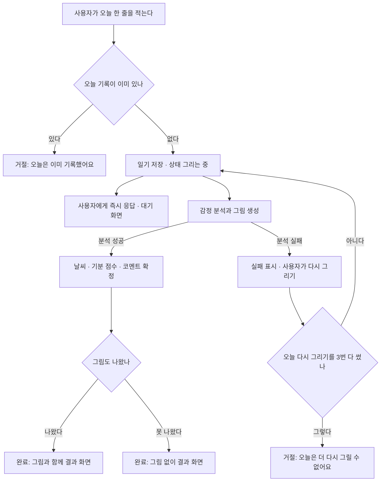
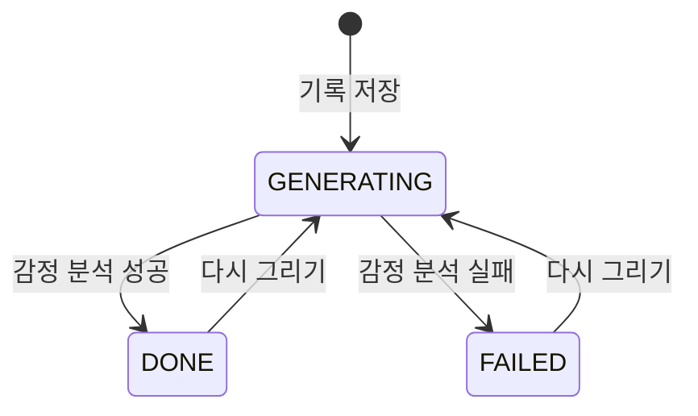

# 일기 생성 비즈니스 로직

> 도메인: `com.jellydiary.diary` · 엔티티 `Diary`(테이블 `tb_diary`)
> 코드: `api/src/main/java/com/jellydiary/diary/**` · 기준 커밋: 6b0de10 이후 미커밋 · 갱신: 2026-09-21

## 1. 실행 흐름

기록을 받은 즉시 응답하고 생성은 뒤에서 진행한다. 사용자는 대기 화면에서 결과를 기다리고, 앱이 1초 간격으로 완료 여부를 확인한다.

## 2. 한눈에 보기

| 항목 | 내용 |
|---|---|
| 목적 | 하루 한 줄을 감정 날씨와 그림으로 바꿔 남긴다 |
| 시작 | 사용자가 홈(화면 02)에서 본문을 적고 기록을 누른다 |
| 주요 참여자 | 사용자 1인. 타인·관리자 개입 없음 |
| 주요 흐름 | 기록 -> 감정 분석·그림 생성 -> 결과 확인 -> (선택) 다시 그리기 |
| 완료 조건 | 감정 분석이 끝나 상태가 `DONE`이 된다. 그림은 없어도 완료다 |
| 완료 결과 | 날씨 1종, 기분 점수(-3~+3), AI 코멘트, 그림 URL(있으면) |
| 하루 한도 | 기록 1건, 다시 그리기 3회 |

## 3. 상태 모델

| 상태 | 의미 | 화면 |
|---|---|---|
| `GENERATING` | 그리는 중. 판정값이 아직 없다 | 03 대기 화면 |
| `DONE` | 감정 분석 완료. `imageUrl`이 비어 있을 수 있다 | 04 결과 화면 |
| `FAILED` | 감정 분석까지 실패 | 04 자리에 재시도 안내 |

> [!IMPORTANT]
> 그림 생성만 실패한 경우는 `FAILED`가 아니라 `DONE`이다. 텍스트 결과만으로도 하루 기록은 성립한다.

## 4. 주요 액션

| 액션 | 실행 주체 | 실행 조건 | 주요 결과 | API |
|---|---|---|---|---|
| 오늘 기록 | 본인 | 오늘 기록이 없음, 본문 1~500자 | 일기 생성(`GENERATING`), 생성 요청 발행 | `POST /api/v1/diaries` |
| 결과 확인 | 본인 | 본인 일기 | 상태와 판정값 조회 | `GET /api/v1/diaries/{id}`, `/today` |
| 최근 기록 보기 | 본인 | - | 날짜 내림차순 목록(커서) | `GET /api/v1/diaries` |
| 다시 그리기 | 본인 | `GENERATING`이 아님, 오늘 3회 미만 | 같은 본문으로 재생성 | `POST /api/v1/diaries/{id}/regenerate` |

## 5. 액션 상세

### 5.1 오늘 기록

- 실행 주체: 본인(`@LoginUser`). 헤더가 없으면 401
- "오늘"의 기준: 서버의 Asia/Seoul 자정 (`app.timezone`)

막히는 경우

| 조건 | 응답 | ErrorCode |
|---|---|---|
| 본문이 비었거나 공백뿐 / 500자 초과 | 400 | `COMMON_INVALID_REQUEST` |
| 오늘 기록이 이미 있음 | 409 | `DIARY_ALREADY_EXISTS` |
| 동시에 두 번 눌러 unique 제약에 걸림 | 409 | `DIARY_ALREADY_EXISTS` |

처리: 본문 앞뒤 공백 제거 -> 저장(`GENERATING`) -> 생성 요청 이벤트 발행 -> 즉시 201 반환.
생성은 **커밋 후 별도 스레드**에서 실행되므로 응답이 AI 속도에 묶이지 않는다.

### 5.2 감정 분석과 그림 생성

- 실행 주체: 서버(비동기). 사용자 조작 없음
- 재시도 없음. 실패는 그대로 `FAILED`로 남기고 사용자의 "다시 그리기"를 기다린다 (호출마다 비용 발생)
- 현재 구현은 규칙 기반 대역이다. 키워드가 날씨를 정하고 날씨가 점수와 코멘트를 정한다

| 날씨 | 기분 점수 | 판정 키워드(예) |
|---|---|---|
| `RAINBOW` | +3 | 합격, 최고, 행복, 설레, 사랑 |
| `SUNNY` | +2 | 좋았, 성공, 즐거, 맛있, 칭찬 |
| `PARTLY_CLOUDY` | +1 | 바쁘, 보통, 무난 (기본값) |
| `CLOUDY` | 0 | 피곤, 답답, 그냥, 무기력 |
| `SNOW` | -1 | 조용, 차분, 고요, 혼자 |
| `RAIN` | -2 | 슬프, 힘들, 울었, 속상, 지쳤 |

키워드가 없으면 사용자가 고른 빠른 감정 칩을 쓰고, 그것도 없으면 `PARTLY_CLOUDY`다.

### 5.3 다시 그리기

| 조건 | 응답 | ErrorCode |
|---|---|---|
| 이미 그리는 중 | 422 | `DIARY_NOT_DONE` |
| 오늘 3회를 다 씀 | 422 | `DIARY_REGENERATE_LIMIT` |
| 남의 일기 | 404 | `DIARY_NOT_FOUND` |

거절 사유가 둘인데 코드가 하나였다. 상한을 다 쓰지 않았는데도 "오늘은 더 다시 그릴 수 없어요"가 나갔다(2026-09-22 수정).

횟수는 일기 행에 누적되며(`regenerate_count`) 날짜가 바뀌면 새 일기라 자연히 초기화된다.

### 5.4 예외를 던지는 자리

거절은 **도메인이 `BusinessException(ErrorCode)`로 직접 던진다.** 서비스가 `IllegalArgumentException`을 잡아
번역하지 않는다 - 번역 계층이 있으면 같은 규칙이 어느 코드로 나가는지가 두 곳에 흩어진다(`api-design` 3장).

| 종류 | 무엇 | 어떻게 |
|---|---|---|
| 비즈니스 예외(4xx) | 본문 길이, 하루 1건, 재생성 상한, 생성 중 | `BusinessException(ErrorCode.XXX)` |
| 시스템 예외(5xx) | 기분 점수 범위 위반, 날씨 null, 설정값 오류 | `IllegalArgumentException` |

기분 점수 범위 위반이 시스템 예외인 이유: 사용자가 만든 상황이 아니라 **AI 어댑터가 계약을 어긴 것**이다.
비동기 생성 중에 터지므로 사용자에게 가지 않고 `FAILED`로 남는다.

## 6. 이력 및 알림

- 별도 이력 테이블 없음. 상태와 재생성 횟수는 일기 행에 남는다
- 알림 없음. 사용자는 앱이 여는 폴링으로 완료를 안다 (완료 푸시는 미정)
- 로그 이벤트

| 시점 | event |
|---|---|
| 기록 저장 | `diary.written` |
| 다시 그리기 요청 | `diary.regenerate_requested` |
| 생성 성공 | `diary.painted` |
| 생성 실패 | `diary.paint_failed` |
| AI 호출 종료 | `ai.call.done` (provider, weather, durationMs) |

## 7. 트랜잭션 경계

`transaction-and-concurrency` 0장의 질문표에 답을 받지 못해 **가정으로 확정**했다. 다르면 여기부터 고친다.

| 질문 | 이 도메인의 답 |
|---|---|
| 전부 취소되어야 하는 범위 | 일기 1건 저장까지. AI 결과 반영은 별도 트랜잭션 |
| 부분 성공 허용 | 허용. 생성이 실패해도 기록은 남는다 |
| 버튼을 두 번 누르면 | unique 제약으로 두 번째는 409 |
| 같은 행 동시 변경 | `@Version` 낙관 락, 충돌 시 409 `COMMON_CONFLICT` |
| 외부 호출 | AI 호출은 트랜잭션 밖(커밋 후 비동기) |
| 재시도 안전성 | 안전하지 않다(비용). 자동 재시도 없음 |

## 8. 알려진 이슈 / TODO

> [!WARNING]
> 빌드·테스트가 한 번도 실행되지 않았다. 이 문서의 동작은 코드를 읽어 정리한 것이며 실행으로 검증되지 않았다.

> [!NOTE]
> - 감정 판정이 규칙 기반 대역이다. 실제 모델을 붙이면 5.2의 표는 무효가 되고 `prompt-and-eval`의 평가 셋이 그 자리를 대신한다.
> - 그림 URL이 외부 더미 이미지를 가리킨다. 실제 구현은 생성 이미지를 스토리지에 저장해야 한다(`file-upload-storage`).
> - 완료 시점을 폴링으로만 알 수 있다. 앱이 꺼진 사이 완료되면 알릴 방법이 없다.
> - 연속 기록 일수는 화면 02·06·10이 모두 쓰지만 아직 계산하는 코드가 없다.

## 변경 이력

| 날짜 | 내용 |
|---|---|
| 2026-09-21 | 최초 작성 (핵심 루프 02-03-04 구현분) |
