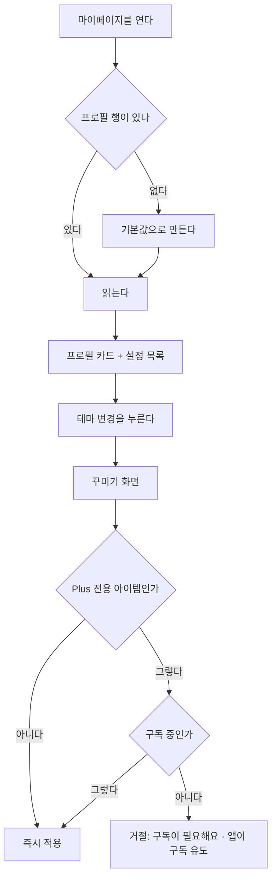

# 프로필 · 꾸미기 비즈니스 로직

> 도메인: `com.jellydiary.profile` · 엔티티 `Profile`(테이블 `tb_profile`)
> 코드: `api/src/main/java/com/jellydiary/profile/**` · 설정 `app.profile.*` · 갱신: 2026-09-22

## 1. 실행 흐름

## 2. 한눈에 보기

| 항목 | 내용 |
|---|---|
| 목적 | 프로필·누적 지표 확인과 꾸미기 |
| 시작 | MY 탭, 또는 10에서 테마 변경 |
| 주요 흐름 | 조회 -> 설정 변경 / 테마·캐릭터 선택 |
| 완료 조건 | 선택이 저장된다 |
| 저장소 | `tb_profile` 1행. 인증 전까지 사용자 테이블을 겸한다 |

## 3. 상태 모델

상태 전이가 없다. 값을 바꾸는 설정 묶음이다.
단 `plus`(구독 여부)만은 **서버에서만** 바뀌며, 지금은 바꾸는 길이 없다.

## 4. 주요 액션

| 액션 | 실행 주체 | 실행 조건 | 주요 결과 | API |
|---|---|---|---|---|
| 프로필 조회 | 본인 | - | 없으면 만들어서 반환 | `GET /api/v1/profile` |
| 설정 변경 | 본인 | - | 보낸 필드만 반영 | `PATCH /api/v1/profile/settings` |
| 카탈로그 조회 | 본인 | - | 테마·캐릭터 + 잠금/선택 여부 | `GET /api/v1/profile/store/items` |
| 아이템 선택 | 본인 | 무료거나 구독 중 | 즉시 적용 | `POST .../store/items/{code}/select` |

## 5. 액션 상세

### 5.1 왜 상점이 별도 도메인이 아닌가

테마·캐릭터 선택은 **프로필의 표시 설정**이다. 소유·결제·재고가 없고 선택 결과는 프로필 행의
컬럼 두 개(`theme_code`, `character_code`)다. 도메인을 나누면 프로필과 상점이 서로를 계속 되묻게 된다.
결제나 개별 구매가 생기면 그때 나눈다.

### 5.2 카탈로그 (`StoreItem` enum)

| 카테고리 | 코드 | 이름 | Plus 전용 |
|---|---|---|---|
| THEME | `JELLY` | Jelly (기본) | - |
| THEME | `NIGHT_JELLY` | Night Jelly | O |
| THEME | `MINT_SODA` | Mint Soda | - |
| THEME | `LAVENDER` | Lavender | O |
| CHARACTER | `JELLY_BEAR` | 젤리곰 (기본) | - |
| CHARACTER | `STAR_CANDY` | 별사탕 | O |
| CHARACTER | `CLOUDY_FRIEND` | 구름이 | O |
| CHARACTER | `SPROUT` | 새싹 | O |

시안의 카테고리 탭 4개 중 **배경·폰트는 항목이 없다.** 09 화면 문서 5장의
"항목 0개면 탭 자체를 숨긴다"에 따라 내려주지도, 보여주지도 않는다.

### 5.3 잠금 판정

**판정은 서버가 한다.** `locked`는 응답에 담겨 오고, 선택 요청도 서버가 다시 검사한다.
클라이언트 플래그를 신뢰하지 않는다(09 화면 문서 6장).

판정 자체는 구독 여부를 아는 `Profile` 엔티티가 한다 - 서비스가 `if (plusOnly && !plus)`를 쓰지 않고,
거절도 엔티티가 `BusinessException(STORE_ITEM_LOCKED)`로 직접 던진다(`api-design` 3장).

| 조건 | 응답 | ErrorCode |
|---|---|---|
| 없는 코드 | 404 | `STORE_ITEM_NOT_FOUND` |
| Plus 전용인데 비구독 | 422 | `STORE_ITEM_LOCKED` |

### 5.4 프로필 자동 생성

인증이 없어 프로필 행이 미리 존재하지 않는다. 첫 조회에서 기본값으로 만든다
(테마 Jelly, 캐릭터 젤리곰, 가입일 = 오늘).

| 기본값 | 어디서 | 왜 거기인가 |
|---|---|---|
| 닉네임 | `NicknameGenerator` (형용사 + 명사, 예: "말랑한 젤리곰") | 모두에게 같은 이름을 주면 08 피드가 같은 닉네임으로 찬다. 단어 목록은 제품의 어휘라 설정이 아니다 |
| 그림 스타일 | `app.profile.default-ai-style` | 기획이 바꾸는 값이다. 엔티티 상수면 배포해야 바뀐다(config-and-secrets 4-1장) |
| 닉네임 길이 상한 | `app.profile.max-nickname-length` -> `ProfilePolicy` | 업무 상한. 스키마 상수 `Profile.NICKNAME_COLUMN_LENGTH`(DDL varchar(30))와 구분한다 |
| 테마·캐릭터 | `StoreItem.DEFAULT_THEME` / `DEFAULT_CHARACTER` | 수치가 아니라 카탈로그의 한 항목이다. 설정으로 두면 없는 코드를 넣을 수 있게 된다 |

생성된 닉네임은 중복될 수 있다. 닉네임에 unique 제약이 없고, 겹쳐도 되는 별명이며 사용자가 바꿀 수 있다.

동시에 두 요청이 들어오면 한쪽이 unique 제약에 걸리는데, 그건 "다른 쪽이 이미 만들었다"는
뜻이라 다시 읽는다.

> [!NOTE]
> 회원가입(`spring-auth`)이 붙으면 이 자동 생성은 그쪽으로 옮기고, 계정 정보도 그쪽으로 간다.
> 여기엔 표시 설정만 남는다.

### 5.5 설정 6행의 실제 구현 상태

| 행 | 서버 | 앱 |
|---|---|---|
| 리마인더 알림 | 값만 저장 (`reminder_time`) | 값 표시. **발송·권한 요청 없음** |
| 테마 변경 | 선택 저장 | 09로 이동, 선택 적용 |
| AI 그림 스타일 | 값만 저장 | 값 표시. **생성 프롬프트에 아직 반영 안 됨** |
| 일기 잠금 | 값 저장 | 눌러서 ON/OFF. **생체/PIN 인증 없음** |
| 데이터 내보내기 | 없음 | 준비 중 안내 |
| 계정 · 로그아웃 | 없음 | 준비 중 안내 |

## 6. 이력 및 알림

- 설정 변경 이력을 남기지 않는다. 마지막 값만 있다
- 알림 없음

## 7. 트랜잭션 경계

| 질문 | 이 도메인의 답 |
|---|---|
| 전부 취소되어야 하는 범위 | 프로필 1행 수정 |
| 버튼을 두 번 누르면 | 같은 값을 두 번 쓰는 것이라 무해하다(멱등) |
| 같은 행 동시 변경 | `@Version` 낙관 락, 충돌 시 409 `COMMON_CONFLICT` |
| 재시도 안전성 | 안전하다 |

## 8. 알려진 이슈 / TODO

- [ ] **계정 삭제가 없다.** 두 스토어 모두 필수 항목이지만 인증이 붙어야 의미가 생긴다(`spring-auth` -> `app-store-release`)
- [ ] 구독 결제·영수증 검증 없음. `plus`를 true로 만들 방법이 서버에도 없다
- [ ] 구독 복원(Restore) 동선 없음. iOS 심사 필수
- [ ] 리마인더 실제 발송과 알림 권한 요청 (`notification`)
- [ ] AI 그림 스타일을 생성 프롬프트에 반영 (`prompt-and-eval`)
- [ ] 일기 잠금 ON일 때의 실제 잠금(생체/PIN)과 05·06 노출 범위
- [ ] 배경·폰트 카테고리 내용 미정

## 변경 이력

| 날짜 | 내용 |
|---|---|
| 2026-09-22 | 최초 작성 (09·10 구현) |
