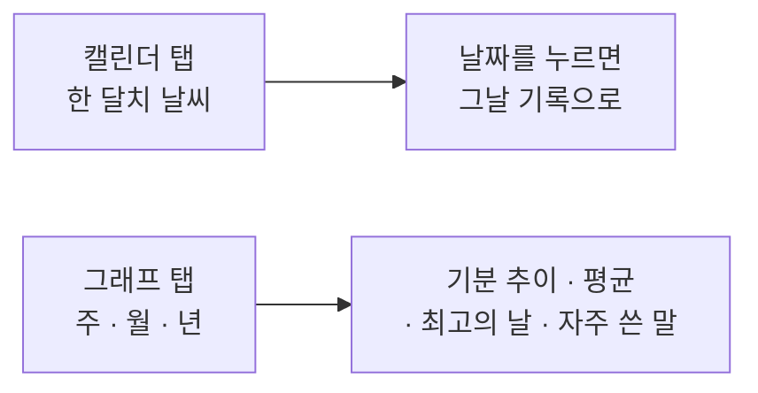

# 감정 캘린더와 그래프

> 기능 소개 (비개발자용) · 상태: 동작함 · 화면 05·06 · 갱신: 2026-09-22

## 무엇을 하는 기능인가

쌓인 일기를 **달력과 추이 그래프로** 보여준다. 하루하루의 기록이 "얼마나 쌓였는지"를 체감하게 하는 화면이다.

## 사용자가 하는 일

1. **달력 보기** - 한 달치 날씨가 날짜 칸에 이모지로 찍힌다. 오늘은 테두리로 표시되고, 아직 오지 않은 날은 흐리게 보인다.
2. **달 넘기기** - 위쪽 `‹ 2026년 8월 ›`로 앞뒤 달을 본다.
3. **그날로 들어가기** - 기록이 있는 날짜를 누르면 그날의 그림과 판정이 나온다.
4. **달 요약 보기** - 달력 아래에 "맑음 12일 / 흐림 6일 / 비 4일"처럼 그 달의 날씨 분포가 나온다.
5. **추이 보기** - 그래프 탭에서 주/월/년을 고르면 기분 점수의 흐름이 선으로 보인다.
6. **지표 보기** - 평균 기분, 최고의 날, 연속 기록 일수, 그 기간에 자주 쓴 말 4개.

## 규칙

| 항목 | 값 |
|---|---|
| 달력 주 시작 | 일요일 |
| 기간 | 주 = 7일, 월 = 30일, 년 = 365일 (오늘 포함) |
| 평균 | 기록이 있는 날만의 평균 |
| 연속 기록 | 오늘을 아직 안 썼어도 어제까지 이어졌으면 유지된다 |
| 자주 쓴 말 | 4개 |

> [!IMPORTANT]
> **기록이 없는 날은 그래프에서 선이 끊긴다.** 0으로 잇지 않는다 - 0은 "기분이 보통이었다"는 뜻이라
> 안 쓴 날을 0으로 채우면 사실이 아닌 그래프가 된다.

## 예외 상황에서 어떻게 보이나

| 상황 | 사용자에게 |
|---|---|
| 그 달에 기록이 하나도 없다 | 달력은 그대로 두고 요약 자리에 "이 달은 아직 기록이 없어요" |
| 기록이 1건 이하다 | 선을 그리지 않고 "기록이 3일 이상 쌓이면 추이를 보여드려요" |
| 비교할 지난 기간이 없다 | "비교할 지난 기간이 없어요" |
| 불러오기에 실패했다 | 그 카드 자리에만 "다시 시도" 버튼 |
| 미래 달로 넘겼다 | 넘어가지만 기록이 없다 |

## 아직 이런 점이 있다

> [!NOTE]
> - "자주 쓴 말"은 띄어쓰기로 자르고 흔한 조사만 떼는 방식이다. "좋았다"와 "좋아서"를 같은 말로 묶지 못한다.
> - 년 보기도 날짜별 선 그래프다. 월별 막대가 더 읽기 좋을 수 있다.
> - 기록이 없는 날짜를 눌러도 아무 일도 일어나지 않는다(지난 날짜 소급 기록이 아직 없다).
> - 그래프의 점을 눌러도 그날로 이동하지 않는다.

## 더 보기

동작 규칙: `../domain/diary/감정집계-비즈니스로직.md` · 화면별 명세: `../screen/05-calendar.md`, `06-graph.md`
