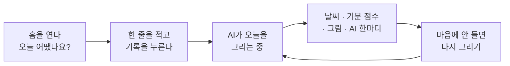

# 오늘 한 줄 기록

> 기능 소개 (비개발자용) · 상태: 동작함 · 화면 02·03·04 · 갱신: 2026-09-21

## 무엇을 하는 기능인가

하루에 한 줄을 적으면 AI가 그 문장의 감정을 읽어 **날씨로 판정하고 그림으로 그려 준다.**

## 사용자가 하는 일

1. **한 줄 쓰기** - 홈에서 "오늘 어땠나요?"에 적는다. 맑음·구름조금·흐림·비 칩으로 기분을 미리 고를 수도 있다. **하루에 한 번만** 쓸 수 있다.
2. **기다리기** - 기록을 누르면 바로 대기 화면으로 넘어간다. 다 그려지면 결과가 저절로 나타난다.
3. **결과 보기** - 날씨 1종, 기분 점수, AI 한마디, 그림.
4. **다시 그리기** - 같은 글로 다시 그릴 수 있다. **하루 3번까지.**
5. **최근 기록** - 홈 아래에 최근 3일의 날씨와 글이 보인다.

## 규칙

| 항목 | 값 |
|---|---|
| 하루 기록 수 | 1건 |
| 글자 수 | 1~500자 |
| 날씨 종류 | 맑음, 구름조금, 흐림, 비, 눈, 무지개 (6종) |
| 기분 점수 | -3 ~ +3 |
| 다시 그리기 | 하루 3번 |
| 하루의 기준 | 한국 시간 자정 |

## 예외 상황에서 어떻게 보이나

| 상황 | 사용자에게 |
|---|---|
| 오늘 이미 썼다 | "오늘은 이미 기록했어요" |
| 그림만 실패했다 | 글과 판정은 그대로 남고, 그림 자리에 "그림을 만들지 못했어요" |
| 감정 분석까지 실패했다 | "오늘을 그리지 못했어요. 다시 시도해 볼까요?" |
| 다시 그리기를 3번 다 썼다 | "오늘은 더 다시 그릴 수 없어요" |
| 인터넷이 끊겼다 | 입력한 글은 화면에 남는다 |

## 아직 이런 점이 있다

> [!NOTE]
> - 감정 판정이 **정해진 단어 규칙**으로 동작한다("합격"이 들어가면 무지개, "힘들"이 들어가면 비). 진짜 AI 모델은 아직 붙지 않았다.
> - 그림도 임시 이미지다.
> - 앱을 꺼 둔 사이에 다 그려져도 알려주지 않는다(완료 알림 없음).
> - 홈의 "연속 기록" 숫자는 아직 계산하지 않는다.

## 더 보기

동작 규칙과 상태 변화: `../domain/diary/일기생성-비즈니스로직.md` · 화면별 명세: `../screen/02-home.md`, `03-generating.md`, `04-result.md`
