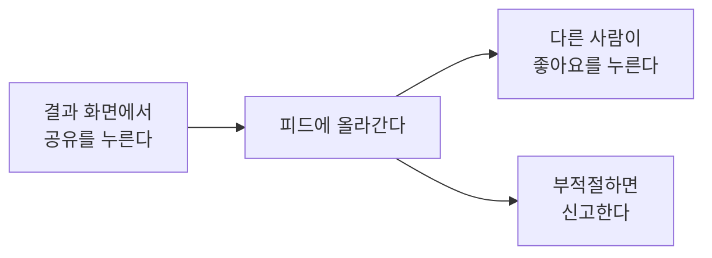

# 커뮤니티 피드

> 기능 소개 (비개발자용) · 상태: 동작함(주의) · 화면 08 · 갱신: 2026-09-22

## 무엇을 하는 기능인가

내 오늘 기록을 **다른 사람에게 보여 주고**, 남의 오늘 날씨를 구경한다.

## 사용자가 하는 일

1. **공유하기** - 오늘 결과 화면(04)에서 "공유"를 누르면 피드에 올라간다. 일기 하나당 한 번만 공유할 수 있다.
2. **구경하기** - 커뮤니티 탭에서 최신순/인기순으로 본다. 맑음·비 칩으로 그 날씨만 골라 볼 수도 있다.
3. **좋아요** - 좋아요를 누른다. 다시 누르면 취소된다.
4. **신고하기** - 카드의 "신고"를 누르고 사유를 고른다.
5. **내 글 지우기** - 내가 올린 글은 지울 수 있다.

## 규칙

| 항목 | 값 |
|---|---|
| 공유 단위 | 일기 1건당 1회 |
| 공유되는 것 | 글·날씨·닉네임. **그림은 올라가지 않는다** |
| 공유 시점 | 다 그려진 뒤에만 |
| 좋아요 | 한 사람 한 번 |
| 신고 | 같은 글에 한 번 |

> [!IMPORTANT]
> 공유는 그 순간의 **복사본**이다. 나중에 원본을 다시 그리거나 지워도 피드의 글은 그대로 남는다.
> 고치고 싶으면 지우고 다시 공유해야 한다.

## 예외 상황에서 어떻게 보이나

| 상황 | 사용자에게 |
|---|---|
| 아직 그리는 중인데 공유했다 | "아직 그림을 그리는 중이에요" |
| 이미 공유한 일기다 | "이미 공유한 일기예요" |
| 고른 날씨의 글이 없다 | "이 날씨의 기록이 아직 없어요" + 필터 해제 버튼 |
| 아무도 공유하지 않았다 | "아직 공유된 기록이 없어요" |
| 좋아요가 실패했다 | 숫자가 원래대로 돌아간다 |

## 아직 이런 점이 있다

> [!WARNING]
> **신고를 받아 두기만 하고 처리하는 도구가 없다.** 자동 숨김도, 차단도, 관리 화면도 아직 없다.
> 실제 스토어에 내보내기 전에 반드시 필요하다.

> [!NOTE]
> - 댓글이 없다. 카드의 댓글 수는 항상 0이다.
> - 카드를 눌러도 상세 화면이 없다.
> - 닉네임이 그대로 보인다. 익명 공유 선택지가 없다.
> - "인기"는 좋아요 누적순이라 오래된 인기 글이 계속 위에 남는다.
> - 피드의 "+ 오늘 공유" 버튼은 홈으로 보낸다. 별도 작성 화면은 없다.

## 더 보기

동작 규칙: `../domain/community/피드공유-비즈니스로직.md` · 화면 명세: `../screen/08-community.md`
